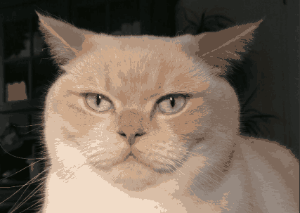
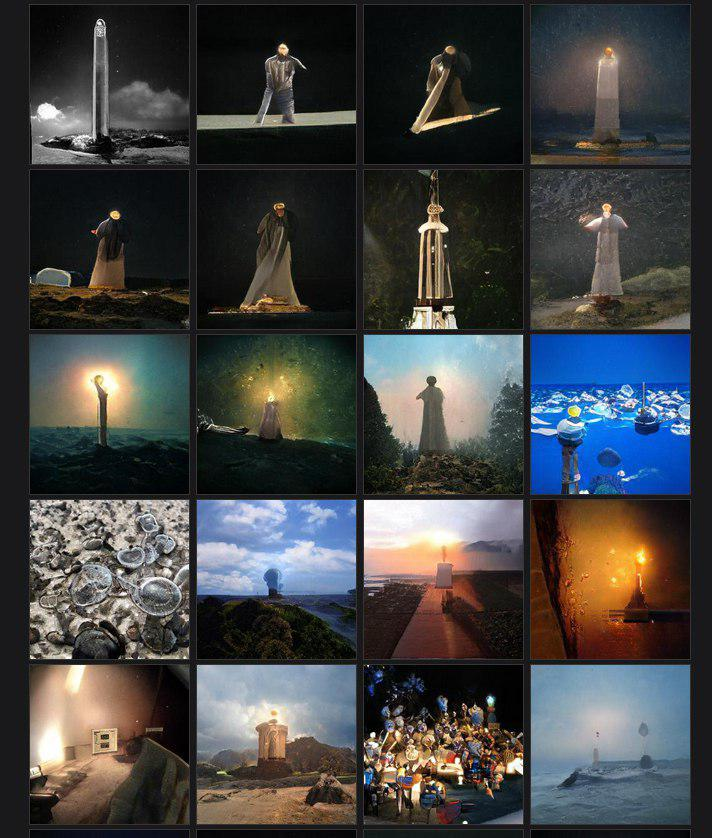

# rps_v1.py
Rock-Paper-Scissors inspired cellular automaton operating on images as initial state.

Images are transformed to a reduced palette of `--wn` colors.
Each color represents one "weapon" (rock/paper/scissors/...), which can effectively defend against its `--wr-pre` previous color-neighbours and its `--wr-post` following color-neighbours.

After loosing against `--lt` neighbours, the last successful attacker takes its spot.

This loss-threshold can be set to cycle based on the current iteration (`--f-lt 0`)

The next iteration can either be calculated based on a copy of the previous iteration (`--new-image 1`) or on based on the same image that is changed during the current iteration (`--new-image 0`).

## Examples
### cat.png

`$ python rps_v1.py --i 100 --nw 20 --wr-pre 0 --wr-post 18 --lt 1 --f-lt 1 --overlap_x 1 --overlap_y 1 --new-image 1 cat.png`

`$ python rps_v1.py --i 100 --nw 20 --wr-pre 18 --wr-post 0 --lt 1 --f-lt 1 --overlap_x 1 --overlap_y 1 --new-image 1 cat.png`

`$ python rps_v1.py --i 100 --nw 20 --wr-pre 0 --wr-post 8 --lt 1 --f-lt 1 --overlap_x 1 --overlap_y 1 --new-image 1 cat.png`

`$ python rps_v1.py --i 100 --nw 20 --wr-pre 0 --wr-post 18 --lt 1 --f-lt 1 --overlap_x 1 --overlap_y 1 --new-image 0 cat.png`

### grid.jpg

`$ python rps_v1.py --i 100 --nw 20 --wr-pre 0 --wr-post 18 --lt 1 --f-lt 1 --overlap_x 1 --overlap_y 1 --new-image 1 cat.png`

# Disclaimer
The code is still rather messy and untested, i just enjoyed the images and kept playing with the details of the implementation.

